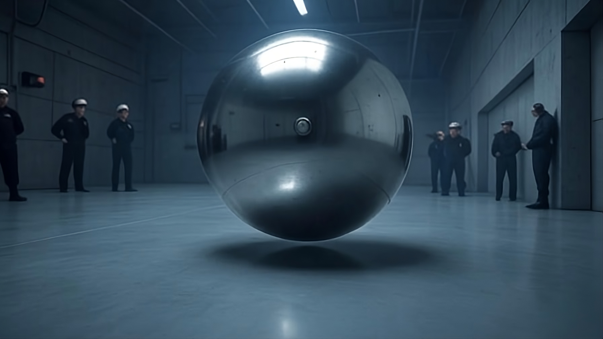
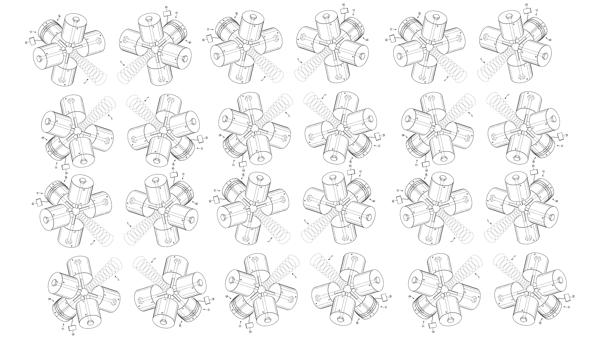
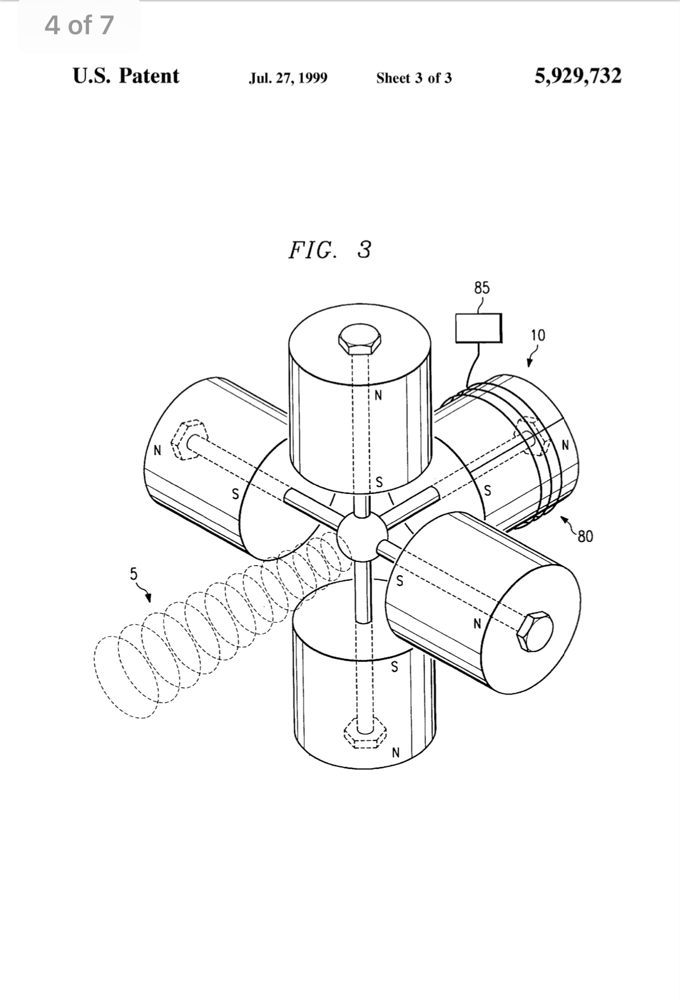
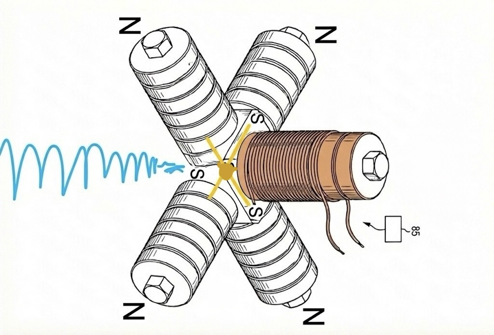

# QED-Vacuum-Thrust-Control

Open-source control system for QED vacuum polarization-based EMF propulsion in combat drones.  Optimizes magnetic circuits with materials like Minnealloy & Hiperco-50 for high-thrust (e.g., Mach 26), stealthy ops in asymmetric warfare.  Features AI navigation, MADA pulsing, thermal management, and simulation tools for defense applications.



*Note: The image above is static. For video sample, see link below.*

**[Very Brief Sample Video: QED Vacuum Thrust Control System](https://drive.google.com/file/d/1_4zi3hHS7li0avwlS-Sk1KF_Y8pp4-vq/view?usp=drivesdk)**

**[Please note: One of the most important tasks is properly shielding your QED vacuum polarization-based EMF propulsion AI control electronics.  I had two high-voltage laboratory power supplies that had to be thrown away.  They weren't damaged due to the aforementioned AFAIK, but that will be many times your difficulty without proper shielding.  *See  [docs/shielding.pdf](docs/shielding.pdf)*]**

[Explore the docs »](docs/)

[Report Bug](https://github.com/jhofseth/QED-Vacuum-Thrust-Control/issues) · [Request Feature](https://github.com/jhofseth/QED-Vacuum-Thrust-Control/issues)

## Table of Contents

- [About The Project](#about-the-project)
  - [Built With](#built-with)
- [Theory Overview](#theory-overview)
- [Key Features](#key-features)
- [Materials Ranking](#materials-ranking)
- [Useful Equations](#useful-equations)
- [Getting Started](#getting-started)
  - [Prerequisites](#prerequisites)
  - [Installation](#installation)
- [Usage](#usage)
- [Roadmap](#roadmap)
- [Contributing](#contributing)
- [License](#license)
- [Contact](#contact)
- [Acknowledgments](#acknowledgments)

## About The Project

This repository provides an open-source control system for advanced EMF propulsion systems based on Quantum Electrodynamics (QED) vacuum polarization.  Drawing from the Refractive Vacuum Gravity (RVG) Unified Field framework—which synthesizes Disformal QED, the 95 GeV dilaton/radion resonance, and the Gordon Optical Metric—it enables simulation and control of magnetic amplification and direction assemblies (MADA) for EMF propulsion in spherical combat drones.  Optimized for asymmetric warfare, it supports high accelerations (>500g), stealth operations, and integration with materials for efficient magnetic circuits.

Key applications include defense scenarios requiring non-ballistic trajectories, hover capabilities, and precision strikes while evading radar and thermal detection.

<p align="right">(<a href="#top">back to top</a>)</p>

### Built With

- 
- 
- 
- 
- 

<p align="right">(<a href="#top">back to top</a>)</p>



## Theory Overview

The system leverages QED vacuum polarization within the Refractive Vacuum Gravity (RVG) Unified Field framework.  Strong opposing magnetic fields (B_opposing >~20 T; depends upon mass, with some B_opposing >60-90+ T) create virtual electron-positron pairs, modifying the vacuum's refractive index and inducing propulsive forces via the Master Equation of Levitation.  Based on the Euler-Heisenberg effective action enhanced by disformal gravity coupling, it achieves thrust via **F ∝ Θ_dilaton(B) ∇(B²)**.  Pulsing (for spherical EMF propulsion drones): 50 Hz default (20 ms cycles) for balance, dynamically scaling to 100 Hz (agility) or 1 kHz (bursts) with variable duty (20-80%) – boosting efficiency 20-50%, evading detection, and extending range.

Inspired by U.S. Patent #5,929,732 (MADA) and the RVG Unified Field model (Hofseth, 2025), which synthesizes Disformal QED with the experimentally observed 95.4 GeV di-photon resonance (CMS/ATLAS, 3.1σ combined significance).  The framework posits this resonance as a dilaton/radion that couples to the trace anomaly of the energy-momentum tensor, permitting macroscopic engineering of the spacetime metric via specific electromagnetic configurations.  A public experiment is needed to confirm the dilaton enhancement factor Θ_dilaton(B), as simulations require it for proper EMF propulsion functionality.  The system is neutral and adaptable to alternative modifier equations derived from experimental data.  All I care about is truth, and QED vacuum polarization-based EMF propulsion is 100% truth that doesn't depend upon any specific theory—only upon a validated modifier equation.

**For more on environmental interactions:**
- [Interaction Mechanisms](docs/mechanism.md) - How the QED vacuum thrust system interacts with aerodynamic, hydrodynamic, and acoustic barriers


<p align="right">(<a href="#top">back to top</a>)</p>

## Key Features

- **AI Navigation**: MIMO networks for 6DOF control and real-time flux mapping
- **MADA Pulsing**: 50-100 Hz pulsing (up to 1 kHz bursts) for efficiency >95%
- **Thermal Management**: PCM channels and optional Bi₂Te₃ TEG for 10-40 kW dissipation
- **Simulation Tools**: Python scripts for vacuum refractive index gradients, thrust calculations, and threat modeling
- **Material Optimization**: Holistic ranking for scalability and cost

<p align="right">(<a href="#top">back to top</a>)</p>

## Materials Ranking

Holistic ranking of magnetic materials for propulsion circuits (as of October 20, 2025):

| Rank | Material | Score |
|------|----------|-------|
| 1 | Finemet Nanocrystalline Iron | 96/100 |
| 2 | Metglas Amorphous Iron | 95/100 |
| 3 | **Minnealloy (α′-Fe₈(NC))** | **95/100** - **BEST OVERALL** |
| 4 | Minnealloy (α″-Fe₁₆(C,N)₂) | 92/100 |
| 5 | Pure Iron (ARMCO) | 90/100 |

*See full table in [docs/materials_ranking.md](docs/materials_ranking.md)*

Prioritizes cobalt-free options for low-cost scalability.  Note: Effects manifest in **any ferromagnetic circuit material** (iron, silicon steel, Hiperco-50, etc.) via internal permeability amplification; higher-saturation materials like Minnealloy (~2.8–2.9 T) simply achieve equivalent peak fields with lower overdrive requirements.

<p align="right">(<a href="#top">back to top</a>)</p>

## Useful Equations

### Comprehensive Tactical Toolkit: Propulsion Equations in the Unified Field Framework

These equations constitute the practical toolkit derived from **The Unified Field: Disformal QED, the 95 GeV Resonance, and the Metric Engineering of Static Levitation** (Hofseth, accessed January 1, 2026). The framework centers on vacuum refractive index gradients modulated by the 95 GeV dilaton/radion resonance, with non-linear enhancements via the trace anomaly coupling. All terms are derived from the Euler-Heisenberg effective action, disformal gravity coupling, and the dilaton-mediated vacuum polarizability; effects remain theoretical and gradient-dependent.

---

#### Magnetic Field Inputs

High opposing gradients maximize vacuum stress and ∇K.

**Precise Axial Field (for solenoid/Halbach stacks):**

$$B(z) = \frac{B_r}{2} \left[ \frac{L + z}{\sqrt{R^2 + (L + z)^2}} - \frac{z}{\sqrt{R^2 + z^2}} \right]$$

(Extend to multi-layer via summation.)

**Opposing Configuration (flux concentration in gap):**

$$B_{\text{gap}} \approx \frac{\mu_0 m_1 m_2}{2\pi d^2} \cdot k$$

($k$: geometry factor; boosted by high-$\mu_r$ cores.)

**Pulsed Drive (asymmetric waveforms for net momentum):**

$$\frac{dB}{dt} = \mu_0 n \frac{dI}{dt}, \quad \Delta B \approx \mu_0 n \Delta I$$

These feed vacuum nonlinearity scaling with $B^2$.

---

#### Vacuum Polarization and Refractive Index

**Refractive Index Dependence:**

$$K(\mathbf{r}) = 1 + \chi_{\text{vac}}(B) \approx 1 + \Theta_{95} \frac{B^2}{B_{\text{crit}}^2}$$

(Non-linear activation strengthens above intense local fields; no strict universal $B_{\text{crit}}$, but higher $B$ yields stronger response.)

**Dilaton Enhancement Factor:**

$\Theta_{\text{dilaton}}(B)$ represents the non-linear vacuum response—weak at low $B$, growing strongly with intensity due to 95 GeV resonance pumping.

**Gradient of Refractive Index:**

$$\nabla K \propto \Theta_{\text{dilaton}}(B) \nabla (B^2)$$

---

#### Thrust and Levitation Performance

**Local Vacuum Force Density (magnetic-dominant, vacuum region):**

$$\mathbf{f}_{\text{vac}} \approx -\frac{B^2}{2\mu_0} \nabla K$$

**Master Equation of Levitation (Integrated Thrust):**

$$\mathbf{F}_{\text{lift}} = \int_V \left( \frac{1}{2\mu_0} \Theta_{\text{dilaton}}(B) \cdot \nabla (\mathbf{B} \cdot \mathbf{B}) \right) dV$$

**Key Components:**

- $\nabla (\mathbf{B} \cdot \mathbf{B}) = \nabla B^2$: Gradient of magnetic energy density drives the force geometry (maximized in Bushman opposing-pole arrays).
- $\Theta_{\text{dilaton}}(B)$: Non-linear enhancement; scales with local $B$ intensity.
- Force scales ∝ T²/m; high localized $B$ essential.
- **Directional Thrust:** Negative gradient in $K$ (increasing with $B^2$) repels the system from regions of highest magnetic energy density. In opposing-stream configurations, thrust is directed opposite the convergence/opposition point on the magnetic circuit wall or gap.

**Universal Critical Requirement: Supra-Saturation Gap Fields**

Effects manifest in **any ferromagnetic circuit material** (iron, silicon steel, Hiperco-50, etc.) via internal permeability amplification and bulk polarization. However, the opposing/convergence gap field ($B_{\text{opposing}}$) must **substantially exceed the material's saturation $B_s$** (≫ $B_s$, driving $\mu_{\text{eff}} \approx 1$ in the high-stress zone) to achieve the intense localized $B$ and steep $\nabla B^2$ required for macroscopic vacuum effects. Higher-saturation materials (e.g., experimental Minnealloy ~2.8–2.9 T) allow equivalent peak $B$ with lower required overdrive/input power; lower-$B_s$ materials (e.g., iron ~2.1 T) simply need proportionally higher opposing drive/geometry compression.

**Non-Linear Insight:**

Vacuum response scales quadratically with local $B$ (force ∝ $B^2 \nabla B^2$ in base regime); supra-saturation engineering enables massive amplification regardless of base material.

**Total Thrust (practical):**

$$\mathbf{F}_{\text{net}} = |\mathbf{F}_{\text{lift}}| \cdot \eta_{\text{align}} \cdot \cos\theta$$

**Acceleration:**

$$a = \mathbf{F}_{\text{lift}} / m_{\text{system}}$$

---

#### Power and Operational Metrics

**Electrical Power Draw:**

$$P = I^2 R_{\text{coil}} + P_{\text{eddy}} + P_{\text{switching}}$$

**Overall Efficiency:**

$$\eta = \left( \frac{|\mathbf{F}_{\text{lift}}| \cdot v}{P} \right) \times 100\%$$

**Endurance Range:**

$$R \approx v \cdot t_{\text{op}} = v \cdot \frac{E_{\text{stored}}}{P}$$

---

#### Comparison Table

| Category | Standard QED / Linear Regime | Unified Field (Dilaton-Enhanced) | Primary Advantage |
|:---------|:-----------------------------|:---------------------------------|:------------------|
| Refractive Index Change | $\Delta K \sim 10^{-22}$ at 1 T | Macroscopic $\Delta K$ via high local $B$ | Engineering feasibility |
| Primary Scaling | Negligible force | $\mathbf{F} \propto \Theta_{\text{dilaton}}(B) \nabla B^2$ | Resonant amplification via 95 GeV scalar |
| Enhancement Mechanism | Euler-Heisenberg only | Dilaton trace anomaly coupling | Ties directly to LHC resonance |
| Gradient Target | Not achievable | Bushman geometry ~10¹⁰ T²/m via supra-saturation | Universal across materials |
| Material Strategy | Irrelevant | Any ferromagnet + high $B_{\text{opposing}}$ overdrive (Minnealloy optimizes) | Practical flexibility |

---

These equations enable direct Python/OpenSCAD/FEMM simulations of Bushman opposing arrays with various cores for Unified Field propulsion modeling. Effects remain theoretical; experimental validation pending high-gradient supra-saturation testing.

---

### Key References

*(Accessed January 1, 2026)*

- **Master Equation & derivation:** Manuscript Sections 4 (Force Density → Master Equation).
- **Directional thrust & opposing geometry:** Section 6 (Bushman array analysis) + Conclusion (supra-saturation note).
- **Dilaton enhancement:** Sections 2–3 (95 GeV resonance + trace anomaly).
- **Disformal/QED foundation:** Section 3 (Gordon metric, disformal coupling).

*Implementations available in `simulations/equations.py`.*

<p align="right">(<a href="#top">back to top</a>)</p>

**Key References** (Accessed December 31, 2025)
- Primary derivation: Disformal metric and thrust integrals in DQED-EG white paper.
- Magnetic catalysis sourcing: arXiv:0901.3413v2 [hep-th].

*Implementations in `simulations/equations.py`.*

<p align="right">(<a href="#top">back to top</a>)</p>

## Magnetic Amplification and Direction Apparatus (MADA)




Good news: Lockheed Martin's patented MADA makes EMF propulsion **~200-500x easier!**

Based on the physical laws governing magnetic fields and the specific text from Lockheed Martin Corporation's [U.S. Patent 5,929,732](https://patents.google.com/patent/US5929732A/en) regarding an "Apparatus and Method for Amplifying a Magnetic Beam", here is the breakdown of the amplification implied.

To achieve the effect described—lifting an object at 6 inches that a standard magnet can only lift at 1 inch—the magnetic assembly would effectively require an amplification of the source **B value** (magnetic field strength) of approximately **216 to 529 times**, depending on the magnetic saturation of the object.

### Why the Amplification is So High

To understand why the number is so high, we have to look at how rapidly magnetic force drops off over distance. It is not linear.

#### The Inverse Cube Law (Field Strength)

The magnetic field (B) of a standard dipole magnet drops off roughly with the cube of the distance (1/r³).

- If you move from 1 inch to 6 inches (6x distance), the field strength drops by a factor of 6³ (6 cubed)
- **6³ = 216**
- **Result:** To deliver the same field strength at 6 inches as you did at 1 inch, your source magnet would need to be **~216 times stronger**

#### The Force Law (Lifting Power)

Lifting a ferric object (like a paperclip or steel weight) depends on both the field strength and the field gradient (how fast the field changes). For a small object, the force (F) typically drops off at the 7th power of the distance (1/r⁷).

- To get the same force at 6x the distance: Amplification = √(6⁷) ≈ **529**
- **Result:** To lift the same weight at 6 inches, the effective magnetic power at the source must be **~529 times greater**

### Implications

In standard physics, achieving a 6x increase in lifting distance is extraordinary. It means the device is projecting magnetic energy with the efficiency of a laser compared to a lightbulb.

| Metric | Value |
|--------|-------|
| Distance Increase | 1 inch → 6 inches |
| Field Decay (1/r³) | 1/216 |
| Force Decay (1/r⁷) | 1/279,936 |
| **Implied Amplification** | **~200x - 500x** |

It is not merely "6 times" stronger. It is demonstrating an **effective B-value amplification of over 200 times** compared to the single magnet, because it is overcoming the massive drop-off in force that usually occurs over that extra 5 inches.

### Practical Application

This means that a MADA can take 5 stacks of 6 cheap N52 magnets with spacers removed ($25 total from Amazon; each stack of 6 is ~3T) to **~600+T B_opposing**. Put that inside a magnetic circuit in opposition to other identical adjacent MADA, and the B_opposing would be massive. That's before even factoring in additional B_opposing from the partially hybridized MADA pole positions.

### Nested MADA Configurations and Hierarchical Amplification

Advanced implementations involve **nesting** or recursion, where each of the five positions in a base MADA unit is replaced by a complete subscale MADA assembly (a "MADA-array").  Each subscale MADA can itself incorporate stacks of up to 12 magnets per position, creating multi-stage hierarchical flux compression.

This recursive approach compounds frustration and focusing effects across levels, potentially achieving extreme localized B_opposing and ∇B² in the central convergence/frustration zone.  For the RVG framework, stacked and nested MADA configurations are particularly potent: the Master Equation rewards ultra-high localized B_opposing and steep ∇B² (potentially >10¹² T²/m in multi-stage frustration points) to strongly pump the dilaton enhancement Θ_dilaton(B), enabling significant vacuum polarization even with standard ferromagnetic cores under supra-saturation drive.

### Implementation in Code

`simulations/equations.py` was updated to reflect:
```python
def opposing_field(m1: float, m2: float, d: float, k: float = 200.0) -> float:
    """
    Calculate opposing magnetic field with MADA amplification.
    
    Args:
        m1: Magnetic moment of first magnet
        m2: Magnetic moment of second magnet
        d: Distance between magnets
        k: Scaling factor for MADA amplification (default 200.0 for ~200x vs. single magnet)
    
    Note:
        k may need to be set up to 529 depending on specific configuration
    """
    # Implementation details...
```

**Key parameter:**
- `k`: Scaling factor for MADA amplification (default `200.0` for ~200x vs. single magnet; may need to be set up to `529`)

### Lockheed Martin Skunk Works' Implementation of MADA in a Midsize CIA Air Branch Saucer-Shaped Mothership

See [Observational Insights](docs/insights.md).

### A Case Study of MADA Emitters and QED Vacuum Propulsion in Action

See [Aviano UAP Analysis](docs/Aviano-UAP-Analysis.md)

## Getting Started

### Prerequisites

- Python 3.12+
- pip

### Installation

If using Windows 11, uninstall other versions of python if not already using Python Manager, then change the default version as below to 3.12.  I was using legacy installers and it refused to respect explicit commands to use 3.12 when creating a virtual environment, and using pip, etc., thereafter.  I even removed path entries for higher versions of python (via Windows key --> type env and hit enter --> select environmental variables and select edit  --> delete entries with 3.14 or other higher versions than 3.12 in them) and this solved using the correct version of python, but *pip was still using the higher version*.  **It is probably possible to do that plus edit the legacy INI, but I did it this way below after uninstalling other versions of python:**  

**Install Python Manager** [https://www.python.org/downloads/](https://www.python.org/downloads/) 

Then install Python 3.12 via

   ```sh
   py install 3.12
   ```

The Python documentation linked (the development version at [https://docs.python.org/dev/using/windows.html#customizing-default-python-versions](https://docs.python.org/dev/using/windows.html#customizing-default-python-versions) describes the INI file (py.ini) as part of deprecated legacy support for the old Python launcher behavior.
In newer Python installations using the Python Install Manager (pymanager), py.ini is no longer supported and will be ignored. Configuration now primarily uses pymanager.json (located at %AppData%\Python\pymanager.json, which expands to C:\Users\<your_username>\AppData\Roaming\Python\pymanager.json).

**Legacy INI File Locations**

For the deprecated launcher (still referenced for equivalence with PY_PYTHON), the launcher searches for py.ini in these locations (in order of precedence):

User's application data directory: %LOCALAPPDATA%\py.ini

(Typically expands to C:\Users\<your_username>\AppData\Local\py.ini)

The directory containing the launcher executable (often C:\Windows\py.ini for system-wide installs)

The user-specific file in %LOCALAPPDATA% takes precedence if both exist.

**Recommended Approach**

Since this is legacy and ignored in the new manager, use the modern methods instead:

Environment variable PYTHON_MANAGER_DEFAULT.

Or the pymanager.json file.

**ALTERNATIVELY**

How to Uninstall Python 3.14 (or whatever higher versions than 3.12) 

Using the Python Install Manager on Windows

The Python Install Manager (managed via the py launcher) allows easy removal of specific Python versions without affecting others. As of January 2026 (Python 3.14 era), use the py uninstall command. This removes the runtime while leaving your other versions (like 3.12) intact.

Step 1: List Installed Versions (Recommended – Verify Tags)

Open PowerShell and run:

*PowerShell*

   ```sh
   py list
   ```

This shows all installed Pythons, including tags (e.g., 3.14, 3.14-64, or similar).
Note the exact tag for 3.14 (from your earlier py -0p, it's likely 3.14 or 3.14-64).

Alternative detailed view:

*PowerShell*

   ```sh
   py -0p
   ```

Step 2: Uninstall Python 3.14 (or whatever higher versions if not using the other strategies)

Run this command (replace <tag> with the exact tag from Step 1, e.g., 3.14):

*PowerShell*

   ```sh
   py uninstall <tag>
   ```

Examples:

*PowerShell*

   ```sh
   py uninstall 3.14
   ```

or

*PowerShell*

   ```sh
   py uninstall 3.14-64
   ```

It will prompt for confirmation (Y/N). Type Y to proceed.

To skip the prompt:

*PowerShell*

   ```sh
   py uninstall --yes 3.14 # (or -y instead of --yes).
   ```

This removes only Python 3.14 and its associated files (from the shared runtime directory).

Step 3: Verify Removal

Run:

*PowerShell*

   ```sh
   py list
   ```

Python 3.14 (or whatever higher version) should no longer appear.

Your default will automatically switch to the remaining highest version (e.g., 3.12).

Also check:

*PowerShell*

   ```sh
   py --version  # Should now show your new default (likely 3.12)
   ```

**INSTALLATION**
1. Clone the repo
   ```sh
   git clone https://github.com/jhofseth/QED-Vacuum-Thrust-Control.git
   ```

2. Navigate to the directory
   ```sh
   cd QED-Vacuum-Thrust-Control
   ```

3. Create a virtual environment
   ```sh
   py -3.12 -m venv venv  # Creates a new venv using Python 3.12
   ```
   
4. Activate the virtual environment
   ```sh
   .\venv\Scripts\activate  # Activates it
   ```
   or in Windows 11 Terminal
   ```sh
   .\venv\Scripts\activate.bat  # Activates it


5. Upgrade pip and build tools
   ```sh
   pip install --upgrade pip setuptools wheel
   ```
   
6. Install the project dependencies
   ```sh
   pip install -r requirements.txt
   ```

<p align="right">(<a href="#top">back to top</a>)</p>

## Usage

**Run simulations:**

```bash
python simulations/thrust_model.py --b_opposing 50 --frequency 100
```

**AI navigation demo:**

```bash
python ai/navigation.py
```

**Advanced options:**

```bash
# Custom parameters
python simulations/thrust_model.py --b_opposing 75 --frequency 200 --mass 15000 --n_units 32

# Verbose output
python simulations/thrust_model.py --verbose
```

See `examples/` for more usage patterns and tutorials.

<p align="right">(<a href="#top">back to top</a>)</p>

## API Documentation

Comprehensive API documentation generated via Sphinx: [View API Docs](docs/api/)

**Key Modules:**
- `simulations/equations.py` - Core physics equations and calculations
- `ai/navigation.py` - MIMO neural network for 6DOF control
- `hardware/interfaces.py` - Hardware interfacing (coming soon)

Generate docs locally:
```bash
cd docs/
make html
```

<p align="right">(<a href="#top">back to top</a>)</p>

## Tutorials

- **[Hardware Setup Guide](docs/tutorials/hardware_setup.md)**: Transitioning from simulations to prototypes
- **[Flight Control Tutorial](docs/tutorials/flight_control.md)**: Real-time systems, PID/MPC, and safety protocols
- **Interactive Notebooks:**
  - [Sensor Fusion Demo](examples/sensor_fusion.ipynb)
  - [ML Optimization](examples/ml_optimization.ipynb)
  - [Swarm Simulation](examples/swarm_simulation.ipynb)
- **Video Tutorials**: Coming soon ([YouTube Playlist](https://youtube.com/playlist?list=PLACEHOLDER))

<p align="right">(<a href="#top">back to top</a>)</p>

## Glossary

- **95 GeV Resonance**: The dilaton/radion scalar boson observed at the LHC (CMS/ATLAS) with 3.1σ combined significance; couples to the trace anomaly and mediates vacuum refractive index modification
- **Disformal Gravity**: Extension of scalar-tensor gravity where the physical metric couples to both the scalar field and its gradient, enabling directional metric distortion
- **Dilaton Enhancement Factor (Θ_dilaton)**: The non-linear vacuum response function that grows with magnetic field intensity due to 95 GeV resonance pumping
- **Gordon Optical Metric**: The effective metric describing photon propagation in a polarized vacuum; connects refractive index gradients to gravitational effects
- **Heisenberg-Euler-Schwinger (HES) Action**: Effective field theory describing nonlinear QED effects in strong electromagnetic fields
- **MADA**: Magnetic Amplification and Direction Assembly – Patent-inspired setup for magnetic beam focusing (U.S. Patent 5,929,732)
- **Master Equation of Levitation**: The integrated thrust equation F = ∫(Θ_dilaton(B)·∇B²)dV that quantifies propulsive force from engineered vacuum gradients
- **Polarizable Vacuum (PV)**: Theoretical representation where gravity manifests as variations in the vacuum's dielectric properties
- **QED Vacuum Polarization**: Quantum effect where virtual particle-antiparticle pairs modify electromagnetic field properties and vacuum refractive index
- **Refractive Vacuum Gravity (RVG)**: The unified field framework synthesizing Disformal QED, the 95 GeV resonance, and metric engineering for propulsion
- **Supra-Saturation**: Operating regime where opposing gap fields substantially exceed material saturation B_s, driving intense localized B and steep ∇B² for macroscopic vacuum effects
- **Trace Anomaly**: Quantum correction that breaks conformal symmetry, enabling the dilaton to couple directly to electromagnetic energy density

Full glossary available in [docs/glossary.md](docs/glossary.md).

<p align="right">(<a href="#top">back to top</a>)</p>

## Roadmap

- [x] Add `experiments/` directory for bench-top test protocols
- [x] Add `cad/` for drone models and 3D visualizations
- [x] Add `testing/` for data logging and test protocols
- [ ] Add full drone CAD models (STEP/STL formats)
- [ ] Integrate ML for gradient optimization
- [x] Support for hardware interfacing (progress: `interfaces.py` but schematics not yet added)
- [ ] Develop firmware for embedded controllers
- [ ] Create simulation-to-hardware pipeline
- [ ] Update Python files to align with RVG Unified Field equations

See [open issues](https://github.com/jhofseth/QED-Vacuum-Thrust-Control/issues) for detailed status and discussions.

<p align="right">(<a href="#top">back to top</a>)</p>

## Contributing

Contributions welcome!  Fork, create a branch, commit, push, and open a PR.

<p align="right">(<a href="#top">back to top</a>)</p>

## License

Distributed under the MIT License.  See `LICENSE` for more information.

<p align="right">(<a href="#top">back to top</a>)</p>

## Contact

Project Link: [https://github.com/jhofseth/QED-Vacuum-Thrust-Control](https://github.com/jhofseth/QED-Vacuum-Thrust-Control)

<p align="right">(<a href="#top">back to top</a>)</p>

## Acknowledgments

- Refractive Vacuum Gravity (RVG) Unified Field Theory (Jesse D. Hofseth) https://dx.doi.org/10.2139/ssrn.5381654
- U.S. Patent #5,929,732 (Lockheed Martin Corporation) https://patents.google.com/patent/US5929732A/en
- [Best-README-Template](https://github.com/othneildrew/Best-README-Template)

<p align="right">(<a href="#top">back to top</a>)</p>
