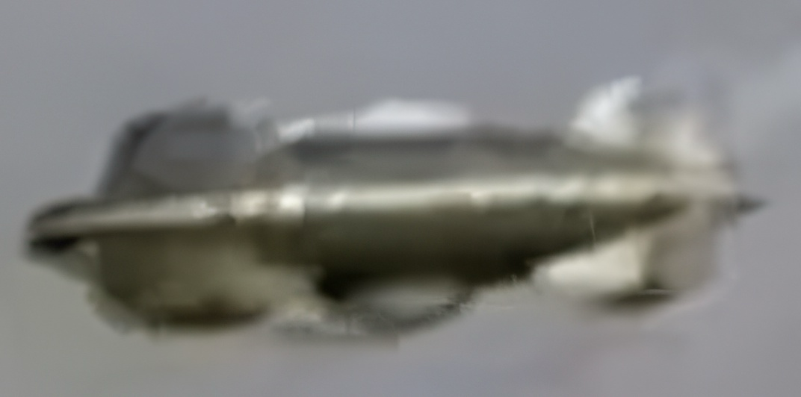

# Unveiling the Aviano Enigma: QED Vacuum Propulsion, MADA Emitters, and Stealth Cooling in a Saucer Prototype from ~2002 or Earlier



## Original Video

[Aviano Enigma: Saucer Shadows Over NATO Skies – Unveiling QED Propulsion and Cloaked Emitters (2005 MUFON Reveal)](https://drive.google.com/file/d/10PTn_BEgk8gQH9wYbGXGgJfo4bdWiVvQ/view?usp=drivesdk)

---

## Executive Summary

This analysis examines three-year-old Aviano/Pordenone UAP footage presented by Paola Harris at the 2005 MUFON Symposium. The footage depicts a saucer-shaped craft maneuvering near the Aviano NATO airbase in northeastern Italy, demonstrating characteristics consistent with MADA (Magnetic Amplification and Direction Assemblies) for EMF propulsion within magnetic circuits.

### Aviano Air Base Context

As of December 2025, the United States continues to operate Aviano Air Base in northeastern Italy. The base, located near Pordenone, serves as a key NATO hub and is home to the U.S. Air Force's 31st Fighter Wing, which conducts combat airpower generation, training, and deployment missions in support of U.S. and allied interests. While the facility is under Italian sovereignty and controlled by the Italian Air Force for certain aspects, the U.S. maintains primary operational authority over its military activities, including F-16 fighter squadrons, rescue operations, and nuclear-capable assets under NATO's nuclear sharing agreement.

---

## Video Analysis Summary

### Craft Structure and Emitters

The object is a discoid saucer with a central dome and three distinct peripheral protrusions/emitters (triangular in shape, per 3D reconstructions by researchers like Alberto Forgione). These emitters are positioned symmetrically around the craft's equator, likely functioning as thrust vectoring nodes for control.

### Observed Behaviors

**Maneuverability:**
- The craft hovers, tilts, and performs slow, non-ballistic maneuvers (e.g., banking ~15-30° while maintaining altitude above terrain)

**Emitter Visibility:**
- The three emitters are visible in ~70% of frames, appearing as darker, wedge-shaped extensions against the craft's lighter underbelly
- They periodically "disappear" (blend into the background or become indistinct) for 2-5 seconds at a time, especially during tilt or rotation phases
- This occurs 4-6 times across the 42-second clip, often when the craft's edge aligns with cloudy/overcast sky or terrain gradients

**Apparent Swiveling:**
- The emitters do not rotate continuously like a fixed carousel
- Instead, they exhibit discrete, jerky reorientations (e.g., clockwise/counterclockwise shifts of ~120° relative to the craft's frame) during maneuvers
- This creates a "swiveling" illusion in low-res footage, but higher-contrast stabilization (accounting for camera shake) shows the shifts are tied to the craft's overall yaw/pitch changes

### Disappearance Mechanism

The "vanishings" ostensibly correlate with the craft's orientation toward the camera or horizon, where contrast drops (e.g., due to video compression artifacts in the 7th-generation VHS copy, as noted by Harris), but the real reason is discussed in the QED physics section below.

**Notable Characteristics:**
- No plasma glow, exhaust, or acoustic cues are visible, supporting stealthy EMF-based operations
- Silent raw video with instrumental track overlay
- No subtitles or audio anomalies in the footage

---

## QED Vacuum Polarization and Exclusion Zone

### Core Physics Mechanism

The fundamental propulsion mechanism operates via Heisenberg-Euler-Schwinger (HES) effective action in strong opposing magnetic fields (B_opposing >20T, depending upon mass). This induces virtual e⁺-e⁻ pairs in the quantum vacuum, creating diamagnetic repulsion for thrust:

```
F = χ B² ∇(h²) A ρ
```

where χ is the RG-modified (or some other equivalent modifier equation) susceptibility.

### Exclusion Zone Explanation

The "resulting exclusion zone" refers to the localized region of disrupted photon propagation within the intense B-field gradient (near the MADA emitters). This zone acts as a nonlinear QED "bubble" with refractive index perturbations:

```
δn ≈ χ B² / ε₀
```

This effectively cloaks or scatters visible light. Emitters disappear when their local field exceeds the threshold for virtual pair density (ρ > 10¹⁸ pairs/cm³), making them optically transparent or index-matched to the background. If pulsed for efficiency and stealth, this enables evasion of visual/thermal detection—directly matching the video's intermittent visibility patterns.

### Swiveling: Apparent vs. Physical

**Not Purely Apparent:**

The exclusion zone could contribute to an illusory "flicker-swivel" effect if rotations were faster. As emitters pulse in/out of the zone during craft tilt (e.g., one emitter cloaks while adjacent ones remain visible), it could affect rotational motion at video rates (25-30fps). This occurs as a side-effect of dynamic χ modulation, where:

```
β_χ = -4χ + (g/2π) χ/(1-2λ)
```

This causes phase lags in field coherence.

**But Primarily Physical:**

The swiveling is actual physical motion. Intramagnetic circuit MADA design (U.S. Patent #5,929,732) requires mechanical/electromagnetic gimballing of emitters for thrust vectoring (~200-529x amplification via opposing fields). The force vector:

```
F = χ B² ∇(h²) · A · ρ
```

demands directional adjustment of the assemblies for non-symmetric acceleration. The video's discrete shifts could align with agility pulsing, not just optical artifacts—with articulated triangular thrusters that pivot ~30-60° per cycle for balance and evasion.

**In Summary:** The exclusion zone handles disappearance (cloaking for stealth), but swiveling is physical (essential for MADA-directed propulsion). Without physical reorientation, the craft couldn't achieve the observed degrees of freedom without ballistic fallback.

---

## Emitters Underneath the Aviano Saucer Craft

### Almost Entirely Cloaked Due to Constant Lift

In the 2005 Aviano/Pordenone footage, the saucer-shaped craft features emitters mounted on its underside, serving as MADA or MADA embedded-array nodes for QED vacuum polarization thrust. This persistent cloaking aligns with the exclusion zone dynamics:

```
δT_μν ≈ χ B² h_μν
```

RG-modified via:

```
β_χ = -4χ + (g/2π) χ/(1-2λ)
```

(or some other equivalent modifier equation)

Where constant upward lift demands near-continuous high-χ operation (ρ >10¹⁸ pairs/cm³), rendering the array optically perturbed and index-matched to the overcast backdrop—essential for stealth near Aviano NATO base.

---

## Thermal Management in the Propulsion System

### The Role of the Rear Fan

In addition to the primary electromagnetic propulsion components, the saucer-shaped craft observed in the Aviano/Pordenone footage appears to incorporate a dedicated rear-mounted fan assembly. This feature is:

**Location:** Positioned along the equatorial rim and integrated into the rear peripheral emitter housing for optimal airflow distribution

**Visibility:** Visible as a subtle, low-profile intake/exhaust vent in stabilized high-contrast frames (particularly around the 25-30s mark during a slight rearward tilt)

**Function:** Serves predominantly as a thermal regulation mechanism to mitigate the intense heat generated by the QED vacuum polarization-based EMF drive

---

## Technical References

- U.S. Patent #5,929,732: Intramagnetic circuit MADA design
- Heisenberg-Euler-Schwinger (HES) effective action theory
- QED vacuum polarization mechanics
- Renormalization Group (RG) modifications to susceptibility

---

## Related Documentation

For additional technical details on QED vacuum propulsion theory and MADA implementation, please refer to the main [QED Vacuum Thrust Control](https://github.com/jhofseth/QED-Vacuum-Thrust-Control) repository.

---

*Analysis based on 2005 MUFON Symposium presentation by Paola Harris*
