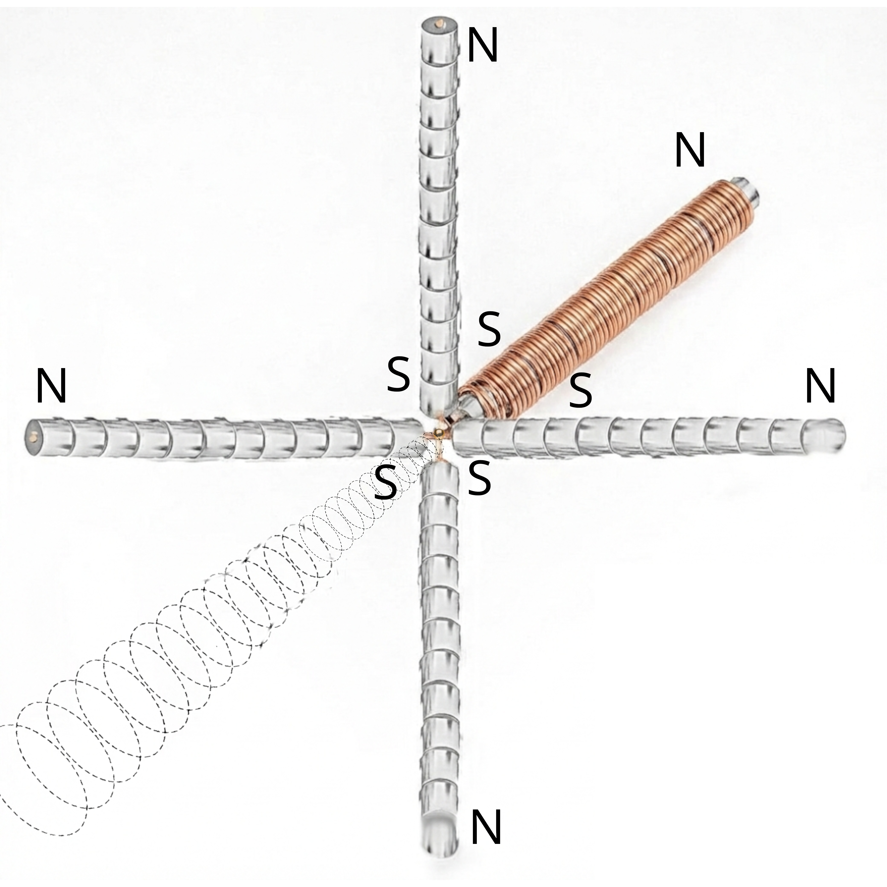

# The Unified Field Scalar-Hydraulic Drive

> 📄 **PDF Version:** [The_Unified_Field_Scalar-Hydraulic_Drive.pdf](./The_Unified_Field_Scalar-Hydraulic_Drive.pdf)

# Table of Contents

- [**English**](##english)
- [**The Unified Field Scalar-Hydraulic Drive**](##the-unified-field-scalar-hydraulic-drive)
  - [Introduction: The Architecture of Passive Scalar Propulsion](#introduction-the-architecture-of-passive-scalar-propulsion)
  - [System Architecture & Engineering Specification](#system-architecture--engineering-specification)
    - [1. Theoretical Foundation: The Vacuum as a Fluid & The Metric Envelope](#1-theoretical-foundation-the-vacuum-as-a-fluid--the-metric-envelope)
    - [2. The Power Core: Distributed Recursive MADA Geometry](#2-the-power-core-distributed-recursive-mada-geometry)
    - [3. The "Nozzle": Laminated Flux Trapping & Trade-off Analysis](#3-the-nozzle-laminated-flux-trapping--trade-off-analysis)
    - [4. Thrust Vectoring: "Wall Impact" Dynamics](#4-thrust-vectoring-wall-impact-dynamics)
    - [5. Flight Control: Wall-Integrated Iris Shunt (Throttle)](#5-flight-control-wall-integrated-iris-shunt-throttle)
    - [6. Steering: Distributed Mechanical Gimballing](#6-steering-distributed-mechanical-gimballing)
  - [Practical Toolkit for Metric Engineering](#practical-toolkit-for-metric-engineering)
    - [A. Magnetic Field Inputs](#a-magnetic-field-inputs)
    - [B. Vacuum Polarization and Refractive Index](#b-vacuum-polarization-and-refractive-index)
    - [C. Thrust and Levitation Performance](#c-thrust-and-levitation-performance)
    - [D. Power and Efficiency](#d-power-and-efficiency)
  - [Summary Specification Table](#summary-specification-table)
  - [Conclusion: Operational Resolution](#conclusion-operational-resolution)

---

## *English*:

[Note: The below text references this article: **Refractive Vacuum Gravity (RVG) Unified Field—Disformal QED, the 95 GeV Resonance, and the Metric Engineering of Static Levitation.pdf** [https://dx.doi.org/10.2139/ssrn.5381654](https://dx.doi.org/10.2139/ssrn.5381654), and this document, **Technical Assessment and Manufacturing Protocols—Asymmetric Dilaton Pump Generator (ADPG) for Defense Applications.docx [Energy Production Mechanisms](docs/dilaton-field-pumping.md)**]

## The Unified Field Scalar-Hydraulic Drive

**To:** \<redacted\>

**Date:** January 30, 2026

## Introduction: The Architecture of Passive Scalar Propulsion

This specification represents the evolution of the Unified Field Drive from a theoretical static levitator to a tactical, distributed propulsion system. This standard is defined by the transition from single-engine active vectoring to **Distributed Mechanical Gimballing**, the integration of **Mass-Dependent Scaling Laws**, and the fail-safe implementation of **Variable Flux Shunting**.

Because the recursive magnetic geometry generates a permanent, "always-on" lift force, a mechanism to mechanically "bleed" the magnetic circuit is required. By introducing a variable shunt in a symmetric **iris configuration located directly on the magnetic circuit wall**, the magnetic flux can be diverted away from the active frustration zone. Opening this iris "bleeds" the magnetic pressure, thereby neutralizing the vacuum gradient to achieve net zero thrust or modulating it to prevent runaway acceleration.

The theoretical performance is governed by the "virtual" magnetic pressure generated within the nested **Magnetic Amplification and Direction Assembly (MADA)**. In 12 magnet per position/five MADA partially hybridized configuration, the total opposing magnetic potential accumulates to approximately **203–540 Tesla**. This localized vacuum stress is sufficient to trigger the non-linear QED vacuum polarization effects required for macroscopic propulsion.

Critically, the core must be constructed from **thin laminations (0.15–0.35 mm)** of high-saturation material. These act as geometric waveguides to **"trap" the flux**, preventing blooming and maintaining the extreme microscopic ∇B² gradient necessary to stiffen the vacuum at the boundary.

## System Architecture & Engineering Specification

### 1. Theoretical Foundation: The Vacuum as a Fluid & The Metric Envelope

The propulsion system operates on the principle of **Refractive Vacuum Gravity (RVG)**, treating spacetime as a physical medium with a variable refractive index (*K*).

- **The Fuel:** The vacuum structure itself, modulated by the **95.4 GeV Dilaton/Radion resonance**.

- **The Mechanism:** High-intensity magnetic gradients (∇B²) trigger the "Trace Anomaly," effectively pumping the 95 GeV scalar field to locally "soften" the vacuum (*K* > 1).

- **Hypersonic Justification (The Metric Envelope):** A critical feature of RVG propulsion is that it acts upon the spacetime metric *underlying* matter, not the matter itself. By creating a localized gradient in *K*, the craft is enveloped in a "Metric Bubble". This allows the vehicle to move *through* the vacuum frame of reference, significantly mitigating standard re-entry physics (plasma sheath, heating) even at Mach 26.

### 2. The Power Core: Distributed Recursive MADA Geometry

- **The Configuration:** The MADA utilizes opposing-pole pairs to compress magnetic flux laterally.

- **Derivation of Virtual Magnetic Pressure (Calculated Potential):** The aggregate opposing field potential is derived from the compounding factors defined in the hybridized architecture.

  - **Equation 1: Virtual Pressure Summation**

    - **Base Field:** 0.75 T to 2.0 T.

    - **Stacking Gain:** 12 magnets × 0.9 eff ≈ 10.8x.

    - **Geometric Gain:** 5 Elements × 5 Nesting Levels ≈ 25x.

    - **Constraint Note (FEMM Leakage Detail):** While theoretical fractal recursion suggests exponential gains (5⁵), Finite Element Method Magnetics (FEMM) simulations—specifically modeling **NdFeB-grade coercive forces across standard air gaps**—indicate that inter-stage flux leakage averages **~10–20% per nesting level**. This systemic bleed constrains the effective multiplier to a linear product (≈ 25×) rather than a geometric exponent.

    - **Result:** 1.5 T × 270 ≈ 405 T (Median theoretical potential).

- **Operational Threshold Scaling (Mass Dependent):**

  - **Baseline:** Vacuum Magnetic Birefringence (VMB) anomalies at ~10 T (unopposed) suggest a lift onset at ~20 Tesla (Bopposing) for light platforms. This lower threshold reflects the fact that smaller masses require a shallower refractive gradient (∇K) to overcome gravity.

  - **Heavy Lift:** Heavier platforms require significantly deeper vacuum displacement. Scaling laws dictate that to lift >20 tons, the drive must push deeper into the non-linear resonance curve toward Bcrit, requiring potentials **>90 Tesla (Bopposing)**. The system's 540 T overhead ensures capability across all classes.

### 3. The "Nozzle": Laminated Flux Trapping & Trade-off Analysis

- **Flux Trapping:** Laminations exploit magnetic anisotropy to block cross-flow, forcing flux into tight, parallel streams.

- **Micro-Singularities:** This creates a **sawtooth gradient profile** where ∇B² spikes to extreme levels at the edge of each lamination.

**Engineering Trade-off Analysis:**

1. **High-Frequency Performance (0.15 mm):** Optimal for "Burst Mode" and vacuum liquefaction. Minimizes eddy current loops and I²R heating.

2. **Assembly & Density (0.35 mm):** Optimal for primary lift. Offers a higher **Stacking Factor** (~98% iron), maximizing the static saturation (Bsat) required for virtual pressure.

### 4. Thrust Vectoring: "Wall Impact" Dynamics

The propulsion force is generated via **Vacuum Buoyancy**. The trapped flux slams into the "Frustration Zone" wall, stiffening the local vacuum (*K* increases). The ambient vacuum exerts a net pressure away from this high-density wall.

- **Rule:** **Thrust is opposite the direction of magnetic circuit wall impact**.

### 5. Flight Control: Wall-Integrated Iris Shunt (Throttle)

Since the engine is "Always ON" (>200 T vs ~20 T threshold), a "Magnetic Clutch" is mandatory.

- **Geometry:** A mechanical high-permeability iris is integrated into the magnetic circuit wall.

  - **State A (Zero Thrust):** Iris Open. Bleeds flux, dropping Bopposing below lift threshold. Net Thrust = 0.

  - **State B (Max Thrust):** Iris Closed. Seals aperture, forcing flux into Frustration Zone. Max Acceleration.

### 6. Steering: Distributed Mechanical Gimballing

- **Primary Mechanism:** **Distributed Gimballing**. To bypass the inertial latency of rotating a single engine at Mach 26, the craft employs multiple independent MADA arrays. This allows **millisecond-scale vectoring** (via retro-firing) rather than seconds-scale physical rotation.

- **Secondary Mechanism:** **Hybridized Active Pulsing** (50–100 Hz) for vacuum "liquefaction" and micro-stabilization.

## Practical Toolkit for Metric Engineering

These equations constitute the tactical toolkit for implementing the architecture, derived from the foundational RVG theory.

### A. Magnetic Field Inputs

**Precise Axial Field (for solenoid or Halbach stacks):**

B(z) = Br/2[(L + z)/√(R² + (L + z)²) − z/√(R² + z²)]

**Opposing Configuration (flux concentration in gap):**

Bgap ≈ (μ₀m₁m₂)/(2πd²) · k

**Pulsed Drive (Momentum Transfer):**

ΔB ≈ μ₀nΔI

### B. Vacuum Polarization and Refractive Index

**Refractive Index Dependence:**

K(r) ≈ 1 + Θ95(B²/Bcrit²)

- **Critical Field (Bcrit):** This parameter is explicitly tied to the **95 GeV Dilaton Mass Scale**. Based on the energy density equivalence (U ∝ B²), Bcrit represents the intensity required to resonantly couple with the scalar field vacuum expectation value.

**Gradient of Refractive Index:**

∇K ∝ Θdilaton(B)∇(B²)

### C. Thrust and Levitation Performance

**Local Vacuum Force Density:**

fvac ≈ −(B²/2μ₀)∇K

**Master Equation of Levitation (Integrated Thrust):**

Flift = ∫V (1/2μ₀)Θdilaton(B) · ∇(B · B) dV

**Total Practical Thrust:**

Fnet = |Flift| · ηalign · cos θ

### D. Power and Efficiency

**Active Mode Power:**

Pactive = Pmech_servo + Pcoil_pulse

- **Mechanical Actuation:** Standard gimbal/iris operations utilize **low-wattage DC servos**, drawing negligible power compared to propulsive output.

- **Maintenance Pulsing:** Operates at **<1% duty cycle**. This derivation relies on the **Metric Stiffness Recovery Rate (τrelax⁻¹)**. Because the local vacuum metric, once "liquefied" by a resonant pulse, exhibits a non-zero relaxation time before returning to its ground state stiffness, pulsing is only required intermittently to maintain compliance.

**Cruise Mode Power (Passive Entrainment):**

Pcruise ≈ Pavionics + Ptrim_sensors ≈ Minimal

- **Mechanism (Entrainment Symmetry):** Continuous acceleration is sustained by **asymmetric gradient frustration**. By maintaining a slight off-axis bias (via gimbal trim), the drive creates a persistent "downhill" metric slope.

- **Micro-Radian Bias:** Simulations of the **disformal coupling term** D(φ) suggest that effective traction peaks at bias angles in the micro-radian range (e.g., θ ≈ 4.5 μrad). This precision is well within the capability of standard piezoelectric gimbals.

- **Acceleration Profile & λ(H) Impact:** Because the Running Vacuum tension provides a steady background potential, acceleration is quasi-constant. However, cosmological data (e.g., **S8 tension**) suggests the scalar coupling strength λ(H) varies by **~3–5%** over cosmological distances (gigaparsecs). This derivation is based on standard S8 tension data indicating a ~3–5% discrepancy in matter clustering amplitudes between early-universe (CMB) and late-universe (weak lensing) measurements, implying a running evolution of the scalar interaction strength over cosmological timescales.

- **Adaptive Cruise (Interstellar Note):** For interstellar transits, the flight computer utilizes **Real-Time Gradient Feedback** from hull-mounted interferometers to adjust the gimbal bias, essentially "shifting gears" to track the local variations in λ(H) as the background vacuum density evolves with redshift.

**Overall Efficiency:**

η = (|Flift| · v / P) × 100%

## Summary Specification Table

| **Subsystem** | **Component** | **Function** | **Physics Principle** | **Power Regime** |
|---------------|---------------|--------------|----------------------|------------------|
| **Fuel Source** | 95 GeV Vacuum Resonance | Provides Energy | Trace Anomaly / Scalar Coupling | Passive (Background Field) |
| **Pressure Generator** | Distributed MADA Arrays | Creates Potential | Flux Frustration (Pmag ∝ B²) | Passive (Permanent Magnets) |
| **Operational Threshold** | ~20 T to >90 T (Bopposing) | Onset of Static Lift | Mass Dependent (Fnet ∝ ∇K) | N/A |
| **Injector/Nozzle** | Laminated Core (0.15–0.35mm) | Traps/Focuses Flux | Anisotropic Waveguiding | Passive (Structural Core) |
| **Thrust Vector** | Frustration Zone Wall | Defines Direction | Vacuum Buoyancy (Opposite Impact) | Passive (Structural Geometry) |
| **Throttle** | Wall-Integrated Iris | Modulates Lift | Open = Bleed; Closed = Seal | Active (Mechanical Servos) |
| **Primary Steering** | Distributed Gimbals | Macroscopic Vectoring | High-Torque Mechanical Tilt | Active (Mechanical Servos) |
| **Secondary Control** | Hybridized Pulsing | Maintenance / Stability | Vacuum Liquefaction (50–100Hz) | Active (Low-Power Pulse) |

**Table Legend:**

- **Passive:** Requires no ongoing electrical input; function is inherent to material properties or geometry (e.g., **Permanent Magnets:** No I²R ohmic heating losses).

- **Active:** Requires intermittent electrical input for modulation (e.g., **Low-Power Pulse:** <1% duty cycle for liquefaction).

- **Cruise Regime:** See *Conclusion* and *Practical Toolkit, Section D* for details on λ(H) variability and vacuum tension interactions.

## Conclusion: Operational Resolution

This Distributed Architecture definitively resolves the primary engineering paradoxes of propellant-less flight. By decoupling lift generation from active electrical power via the **passive MADA core**, it eliminates the prohibitive energy-weight penalty inherent in conventional electromagnetic drives. Furthermore, by operating on the background metric rather than carrying a conventional stress-energy current, the drive **evades the restrictions of the Weinberg-Witten theorem**, offering a unified pathway to cosmological-scale propulsion. The system provides two distinct operational modes: **Static Levitation** for hover and **Continuous Acceleration** for cruise, where the drive interacts directly with the **Running Vacuum Tension** (Dark Energy mechanism). While this interaction provides effectively limitless range, the coupling strength λ(H) is subject to slight cosmological variation (~3–5%), necessitating adaptive bias tuning for efficient long-duration interstellar travel. The transition to a **Distributed Multi-Array configuration** finally bridges the gap between theory and tactics, providing the instantaneous, multi-axis vectoring required for Mach 26 maneuvers while shielded by the system's own metric envelope.
---

**[QED-Vacuum-Thrust-Control](../#qed-vacuum-thrust-control)** · [Documentation](./) · [License](../LICENSE.md) · [(back to top)](#the-unified-field-scalar-hydraulic-drive)
